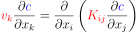
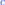
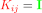
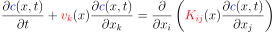
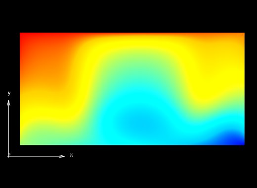
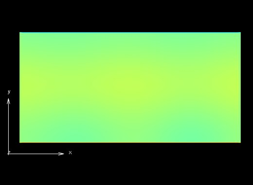
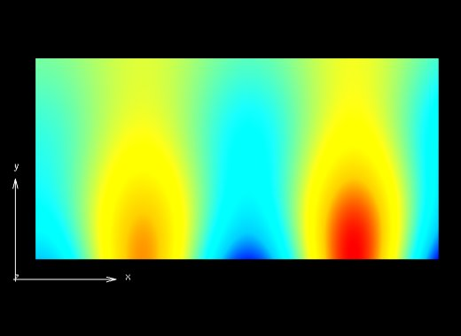
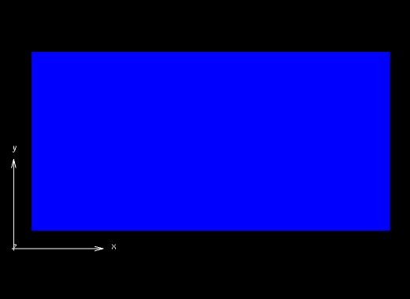
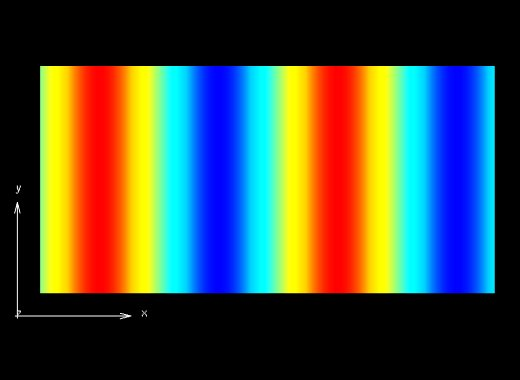
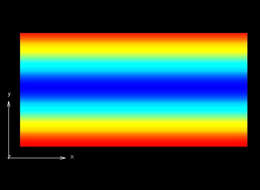

===================================
Static Advection Diffusion Equation
===================================

This example solves the weak form of the following static advection-diffusion equation, 

|static_advection_diffusion_equation|

using the Galerkin method. |velocity_vector| and |conductivity_tensor| are the velocity vector and symmetric, positive definite rank two conductivity tensor respectively. The dependent variable |c| is a spatially varying scalar field (e.g. concentration of constituents or species). Note that the velocity field must be prescribed. In this example an isotropic and homogeneous material with |equation1| (identity tensor) and |equation2| is considered. 

The general form of the advection-diffusion eqaution is

|full_advection_diffusion_equation|.

   :align: middle

   :align: bottom

   :align: middle
   

   :align: bottom
   

   

   :align: bottom   
   

   :align: middle
   
Building the example
====================

The fortran version of the example can be configured and built with CMake::

  git clone https://github.com/OpenCMISS-Examples/static_advection_diffusion_equation
  mkdir static_advection_diffusion_equation-build
  cd static_advection_diffusion_equation-build
  cmake -DOpenCMISSLibs_DIR=/path/to/opencmisslib/install ../static_advection_diffusion_equation
  make
  
This will create the example executable "static_advection_diffusion_equation" in ./src/fortran/ directory.

Running the example
===================

Fortran version::

  cd ./src/fortran/
  ./static_advection_diffusion_equation

Verifying the example
=====================

Results can be visualised by running `visualise.cmgui <./src/fortran/visualise.cmgui>`_ with the `Cmgui visualiser <http://physiomeproject.org/software/opencmiss/cmgui/download>`_.

The following figure shows the solutions and various field variables (source term, diffusivity and velocity - the independent variable). 

   :width: 250
   :scale: 100

   :width: 250
   :scale: 100
   

   :width: 250
   :scale: 100   
   

   :width: 250
   :scale: 100
  

   :width: 250
   :scale: 100     
  

   :width: 250
   :scale: 100   
  
  
|figure1a|  |figure1b|  |figure1c|

Figure 1. (a) Primary variable solution (b) Secondary variable solution (c) Source term

|figure1d|  |figure1e|  |figure1f|

Figure 1. (a) Conducivity (b) Velocity-x component (c) Velocity-y component

The expected results from this example are available in `expected_results <./src/fortran/expected_results>`_ folder.  

Prerequisites
=============

There are no additional input files required for this example as it is self-contained.

License
=======

License applicable to this example is described in `LICENSE <./LICENSE>`_.
